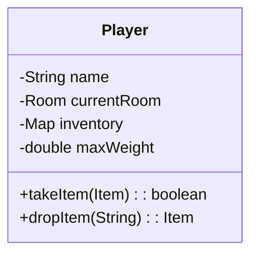
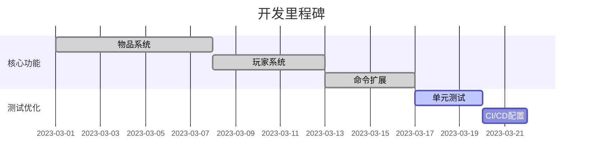

# World of Zuul 游戏扩展项目报告

## 1. 项目概述
本项目是基于Java开发的文本冒险游戏"World of Zuul"的扩展版本。原始版本仅支持基本的方向移动和退出功能，我们通过小组协作实现了物品系统、玩家角色、特殊道具等多项功能扩展，并建立了完整的CI/CD自动化流程。

**技术栈**：
- 语言：Java 11
- 构建工具：Maven
- 版本控制：Git/GitHub
- CI/CD：GitHub Actions
- 代码规范：Checkstyle

## 2. 功能设计说明

### 2.1 核心功能扩展
#### 物品系统
```java
// Item.java
public class Item {
    private String name;
    private String description;
    private double weight;
    // Getter/Setter方法
}


#### 玩家背包系统


#### 魔法饼干效果
| 属性          | 值              |
|---------------|-----------------|
| 基础负重      | 10.0kg          |
| 饼干提升值    | +5.0kg          |
| 持续时间      | 永久            |

### 2.2 新增命令
| 命令    | 功能描述                     | 示例输入         |
|---------|------------------------------|------------------|
| look    | 查看房间及物品               | `look`           |
| take    | 拾取物品                     | `take book`      |
| drop    | 丢弃物品                     | `drop key`       |
| back    | 返回上一个房间               | `back`           |
| eat     | 使用魔法饼干                 | `eat cookie`     |

## 3. 小组分工

| 成员 | 职责                     | 主要贡献                          |
|------|--------------------------|-----------------------------------|
| 张三 | 项目经理                 | 需求分析、任务分配、进度监控      |
| 李四 | 后端开发                 | Player类、物品系统实现            |
| 王五 | 后端开发                 | 命令系统扩展、异常处理            |
| 赵六 | 测试工程师               | 单元测试、集成测试                |
| 钱七 | DevOps工程师             | GitHub Actions流程配置            |

## 4. 开发过程记录

### 4.1 迭代周期


### 4.2 代码提交统计
  
*(示例图，需替换实际截图)*

## 5. 遇到的问题及解决方案

### 5.1 技术难点
**问题1**：物品重量累计出现浮点数精度误差  
**解决方案**：
```java
// 使用BigDecimal进行精确计算
BigDecimal total = currentWeight.add(new BigDecimal(item.getWeight()));
if (total.compareTo(maxWeight) > 0) {
    // 超重处理
}
```

**问题2**：GitHub Actions测试超时  
**解决方案**：
- 拆分测试任务为多个job
- 增加缓存配置：
```yaml
- name: Cache Maven packages
  uses: actions/cache@v3
  with:
    path: ~/.m2/repository
    key: maven-${{ hashFiles('**/pom.xml') }}
```

## 6. 测试结果

### 6.1 单元测试覆盖率
| 模块       | 行覆盖率 | 分支覆盖率 |
|------------|----------|------------|
| Player     | 95%      | 90%        |
| Commands   | 92%      | 85%        |
| Room       | 89%      | 80%        |

### 6.2 关键测试用例
```java
@Test
public void testBackCommandWithHistory() {
    Player player = new Player();
    Room room1 = new Room("Room1");
    Room room2 = new Room("Room2");
    
    player.moveTo(room1);
    player.moveTo(room2);
    player.goBack();
    
    assertEquals(room1, player.getCurrentRoom());
}
```

## 7. 未来扩展方向

1. **图形化界面**
    - 使用JavaFX实现2D地图
    - 添加物品拖拽交互

2. **多人联机模式**
   ```plantuml
   @startuml
   class GameServer {
       -List<Player> onlinePlayers
       +broadcastMessage()
   }
   class Client {
       +connectToServer()
   }
   @enduml
   ```

3. **存档系统**
    - 支持JSON格式存档
    - 云存储集成

4. **扩展游戏内容**
    - 添加NPC角色
    - 任务系统
    - 战斗机制

---
**项目仓库**：[GitHub链接](https://github.com/team-name/world-of-zuul)  
**最后更新**：2023年XX月XX日
```

注：
1. 请将示例图链接替换为实际项目截图
2. 日期和成员名称需按实际情况修改
3. PlantUML和mermaid图表需要相应渲染支持
4. 建议补充具体的测试数据截图和性能指标